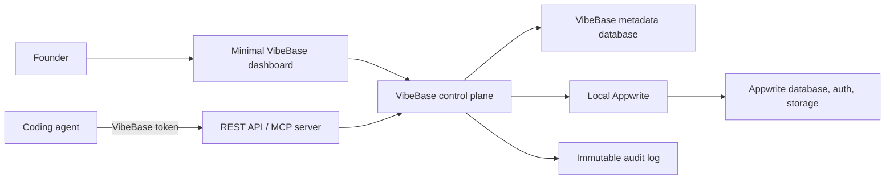

# VibeBase V1 Architecture

## Principle

VibeBase V1 is a control plane layered on top of Appwrite. We do not fork Appwrite. Keeping it separate makes local development faster, preserves upgrade paths, and lets VibeBase own the agent experience. Dokploy is a V2 deployment-engine integration.

## Components

| Component | Responsibility | V1 technology direction |
| --- | --- | --- |
| Dashboard | Founder sign-in, project/token management, visibility | Next.js web app |
| Control-plane API | Authorization, validation, abstraction over Appwrite | TypeScript service / Next.js route handlers initially |
| MCP server | Tools for MCP-compatible coding agents | TypeScript MCP server, same service layer as REST |
| Metadata store | Users, projects, token hashes, scopes, audit events | Appwrite database initially |
| Backend engine | Data, auth, files, functions | Self-hosted Appwrite via Docker |
| Deployment engine | App deploys, env vars, status, logs | V2: isolated Dokploy integration |
| Local gateway | Stable local endpoints and environment config | Docker Compose |

## Local development topology

Everything runs on the builder's machine for the V1 demo. Docker runs VibeBase, PostgreSQL, Redis, Appwrite, and Appwrite's official dependencies. The coding agent receives only a VibeBase token, never an Appwrite administrator key.

This means VibeBase metadata, database storage, file storage, and auth data are handled by local containers and the machine's disk/CPU/RAM. It is suitable for a demo and development, not high availability.

## Trust boundaries

| Actor | May access | Must never access directly |
| --- | --- | --- |
| Founder browser | VibeBase dashboard and their own project metadata | Appwrite admin key |
| Coding agent | Scoped VibeBase API/MCP actions | Appwrite admin key, other projects |
| VibeBase control plane | Appwrite server SDK and metadata store | Nothing outside configured local environment |
| Appwrite | Its own internal services and data | VibeBase token secrets in plaintext |

## Request lifecycle

1. Agent sends an action with a VibeBase bearer token.
2. API verifies the token hash, project ownership mapping, and requested scope.
3. API validates the action against a small allowlist and creates an audit event.
4. API calls Appwrite through a server-side adapter.
5. API normalizes the result and returns it to the agent.
6. Dashboard reads the resource summary and audit events from VibeBase.

## Future hosted architecture

Hosted VibeBase will need per-tenant isolation, managed Appwrite/project provisioning, managed Dokploy or deployment-worker provisioning, secret management, billing, observability, backups, and regional deployment. This is a V2+ platform concern and must not be hidden behind the local-demo implementation.
